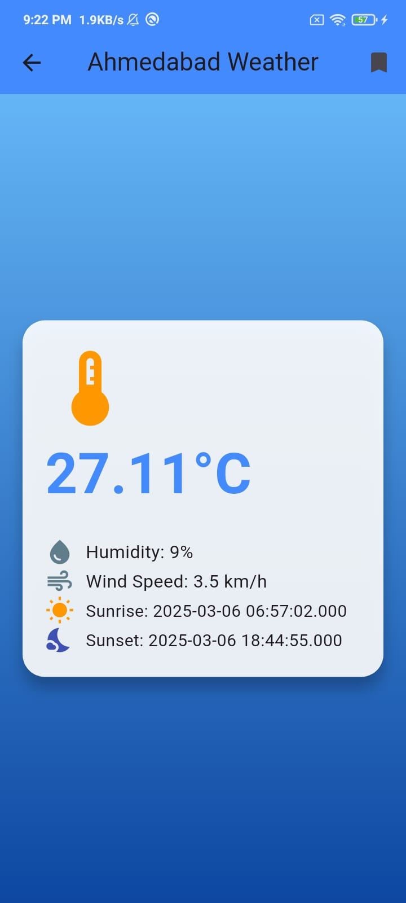

🌤️ Sky Scrapper - Weather App

📌 Project Overview

"Sky Scrapper" is a feature-rich weather application developed using Flutter. It provides accurate and real-time weather information for cities, states, and countries. The app integrates API calling, Shared Preferences, and network connectivity checks to ensure a seamless and user-friendly experience.

✨ Features

🌍 API Calling

🌦️ Fetches real-time weather data from a reliable weather API.

📊 Displays temperature, humidity, wind speed, and other meteorological details.

💾 Shared Preferences

⭐ Allows users to save frequently searched locations.

📌 Provides a dedicated page to view saved locations quickly.

🌐 Network Connectivity Checks

📶 Ensures smooth access to weather data.

⚠️ Displays an error screen when network connectivity is unavailable, along with suggestions for resolution.

🔍 Search by City/State/Country

🏙️ Users can enter a city, state, or country to retrieve weather details.

📋 Information is displayed in a user-friendly and organized manner.

🎨 Light & Dark Themes

🌞 Supports both light and 🌙 dark modes for a comfortable viewing experience.

🔄 Users can switch between themes based on their preference.

🚀 Splash Screen

🎬 Features an engaging splash screen with app branding and animations.

📊 Detailed Weather Screens

📝 Displays comprehensive weather data for a selected location.

⏳ Includes hourly and daily forecasts, precipitation chances, and sunrise/sunset times.

🖼 Screenshots

🛠️ Installation & Setup

Clone the repository

git clone https://github.com/your-repository/sky-scrapper.git
cd sky-scrapper

Install dependencies

flutter pub get

Run the app

flutter run

📋 Requirements

🏗️ Flutter SDK

🎯 Dart

🔑 API Key from a weather data provider

🖥️ Framework: Flutter

📜 Language: Dart

💾 Storage: Shared Preferences

🔗 Networking: HTTP Requests

